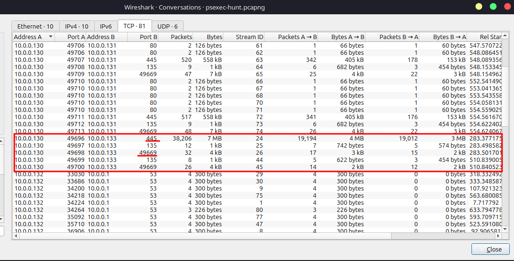
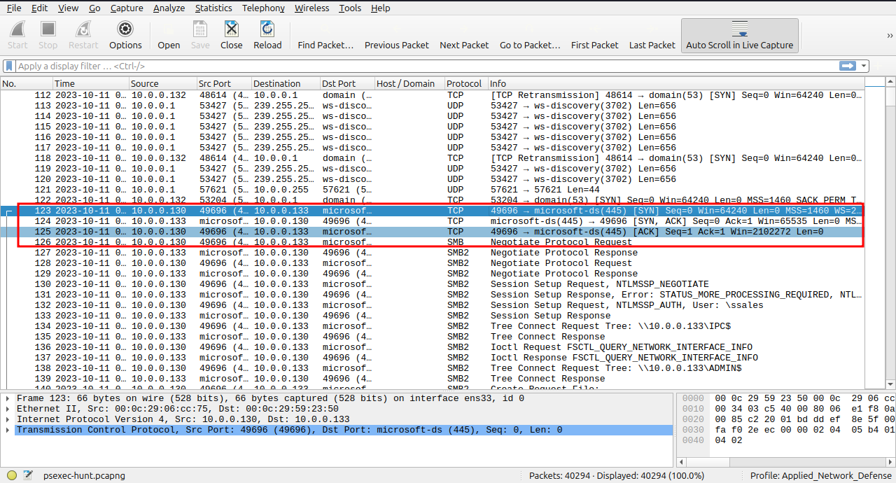
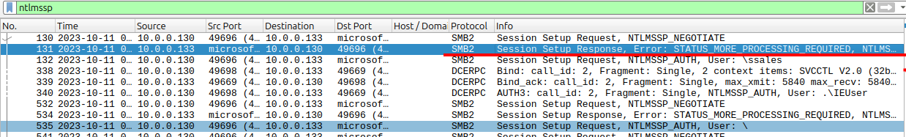
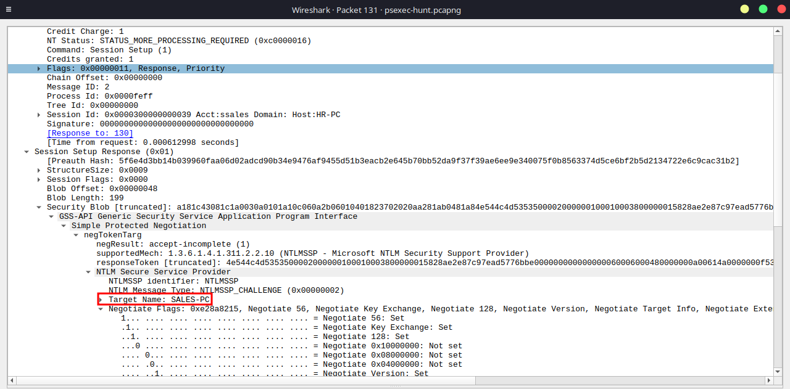
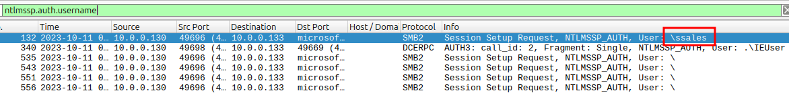
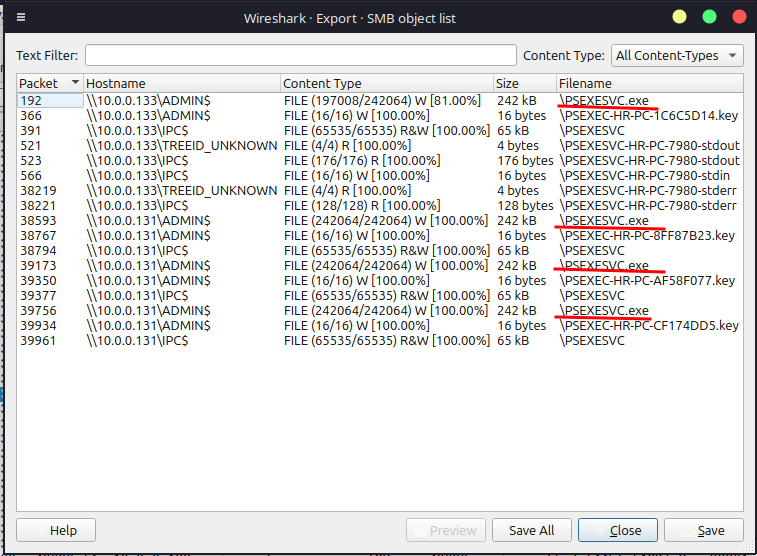
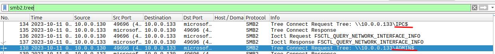
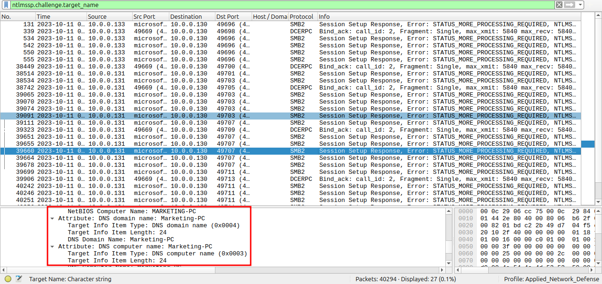

# PsExecHunt - WriteUp

* **Platform:** CyberDefenders
* **Category:** Network Forensics
* **Difficulty:** Easy
* **Tactics:** Execution, Defense Impairment, Discovery, Lateral Movement
* **Tool:** Wireshark

# Scenario

An alert from the Intrusion Detection System (IDS) flagged suspicious lateral movement activity involving PsExec. This indicates potential unauthorized access and movement across the network. As a SOC Analyst, your task is to investigate the provided PCAP file to trace the attacker’s activities. Identify their entry point, the machines targeted, the extent of the breach, and any critical indicators that reveal their tactics and objectives within the compromised environment.

# Q1. To effectively trace the attacker's activities within our network, can you identify the IP address of the machine from which the attacker initially gained access?

**Answer:** `10.0.0.130`

I identified `10.0.0.130` as the origin point of the attack within the network.

Checking **Statistics > Conversations**, I noticed `10.0.0.130` sending a large volume of packets to `10.0.0.133`. Using this clue, I analyzed the traffic for unusual protocols and ports until pinpointing the initial malicious activity.

With this hint, i search something weird in the file, some port, info, destination or protocol, and then.. i find it.

# Q2. To fully understand the extent of the breach, can you determine the machine's hostname to which the attacker first pivoted?

**Answer:** `SALES-PC`

I applied the `ntlmssp` display filter to isolate NTLM authentication messages.

Next, I selected the `NTLMSSP_CHALLENGE` packet (`Session Setup Response`) returned by `10.0.0.133` and expanded the packet details: **SMB2 > NTLM Secure Service Provider > NTLMSSP_CHALLENGE > Target Info**. The target computer name was listed directly in these attributes.

# Q3. Knowing the username of the account the attacker used for authentication will give us insights into the extent of the breach. What is the username utilized by the attacker for authentication?

**Answer:** ssales

I applied the filter `ntlmssp.auth.username` to extract the username in Wireshark from the NTLMSSP Authenticate message. 

Inspecting the authentication payload reveals the compromised account directly in plain text.

# Q4. After figuring out how the attacker moved within our network, we need to know what they did on the target machine. What's the name of the service executable the attacker set up on the target?

**Answer:** PSEXESVC.exe

To locate the service executable deployed on the target, I navigated to **File > Export Objects > SMB**.

Among the extracted files, `PSEXESVC.exe` clearly stands out as the service binary transferred to the host.

# Q5. We need to know how the attacker installed the service on the compromised machine to understand the attacker's lateral movement tactics. This can help identify other affected systems. Which network share was used by PsExec to install the service on the target machine?

**Answer:** ADMIN$

I applied the `smb2.tree` filter to inspect Tree Connect requests directed at administrative shares.

![[tree.png]]

This highlighted the connection request to `ADMIN$`, which PsExec requires to drop and install its service binary on the target.

# Q6. We must identify the network share used to communicate between the two machines. Which network share did PsExec use for communication?

**Answer:** IPC$

Using the same `smb2.tree` filter, I reviewed the connected shares. Alongside `ADMIN$`, the attacker connected to `IPC$`, which PsExec utilizes for inter-process communication and remote control.

# Q7. Now that we have a clearer picture of the attacker's activities on the compromised machine, it's important to identify any further lateral movement. What is the hostname of the second machine the attacker targeted to pivot within our network?

**Answer:** Marketing-PC

To trace additional lateral movement, I applied the filter `ntlmssp.challenge.target_name` and searched for hostnames other than `SALES-PC`, which immediately revealed the connection to `Marketing-PC`.

