# Web Investigation

- **Platform:** CyberDefenders
- **Category:** Network Forensics
- **Difficulty:** Easy
- **Tactics:** Initial Access, Persistence, Command and Control
- **Tools:** Wireshark, CyberChef, Python, WhatIsMyIPAddress.com

# Scenario

You are a cybersecurity analyst working in the Security Operations Center (SOC) of BookWorld, an expansive online bookstore renowned for its vast selection of literature. BookWorld prides itself on providing a seamless and secure shopping experience for book enthusiasts around the globe. Recently, you've been tasked with reinforcing the company's cybersecurity posture, monitoring network traffic, and ensuring that the digital environment remains safe from threats.  
Late one evening, an automated alert is triggered by an unusual spike in database queries and server resource usage, indicating potential malicious activity. This anomaly raises concerns about the integrity of BookWorld's customer data and internal systems, prompting an immediate and thorough investigation.

As the lead analyst in this case, you are required to analyze the network traffic to uncover the nature of the suspicious activity. Your objectives include identifying the attack vector, assessing the scope of any potential data breach, and determining if the attacker gained further access to BookWorld's internal systems.

# Q1. By knowing the attacker's IP, we can analyze all logs and actions related to that IP and determine the extent of the attack, the duration of the attack, and the techniques used. Can you provide the attacker's IP?

**Answer:** `111.224.250.131`

If we enter **Statistics** > **Conversations** > **IPv4** we can see the IP Address and in fact, see the IP Attacker seeing what IP has a lot of packet or much more Bytes than the others IP.

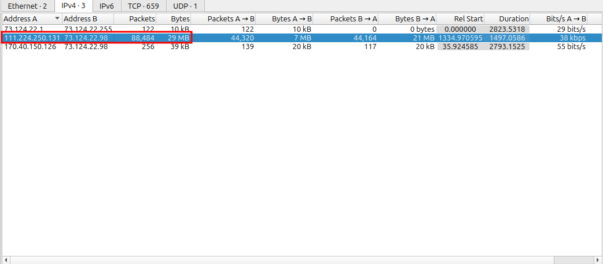

# Q2. If the geographical origin of an IP address is known to be from a region that has no business or expected traffic with our network, this can be an indicator of a targeted attack. Can you determine the origin city of the attacker?

**Answer:**  `Shijiazhuang`

I use the online tool **WhatisMyIpAddress.com** to search what is the city for the ip.

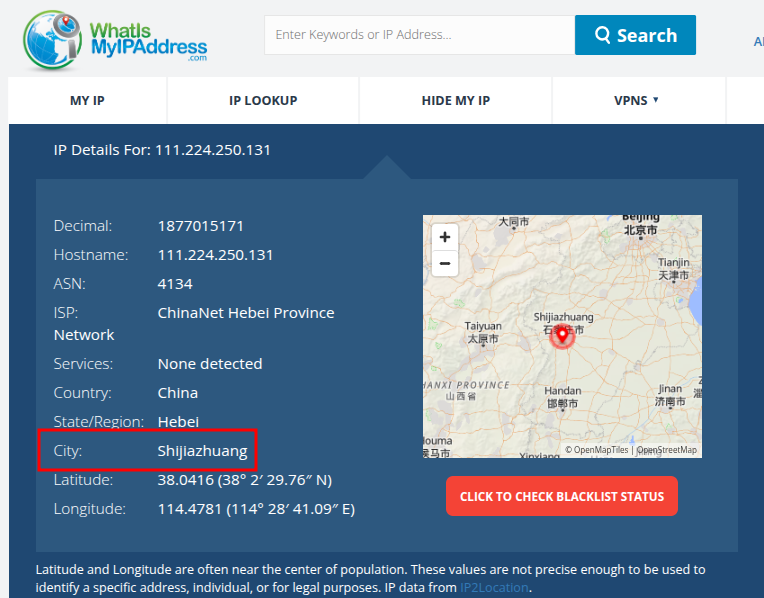

# Q3. Identifying the exploited script allows security teams to understand exactly which vulnerability was used in the attack. This knowledge is critical for finding the appropriate patch or workaround to close the security gap and prevent future exploitation. Can you provide the vulnerable PHP script name?

**Answer:** `search.php`

I applied the filter **http contains ".php"** to only see logs that contains .php and discover the most used (the most used frequently is the vulnerable script).

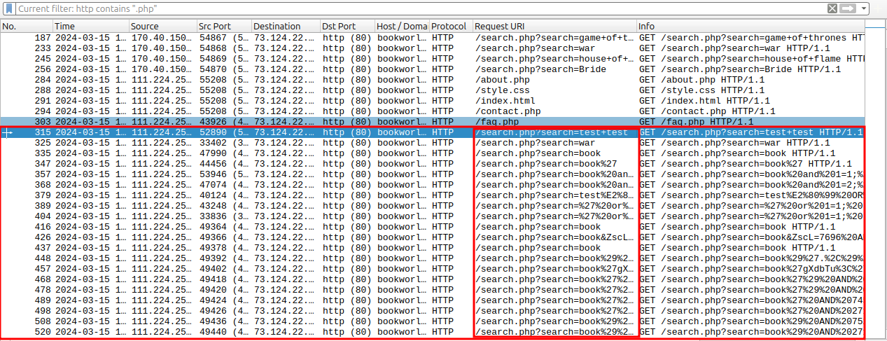

# Q4. Establishing the timeline of an attack, starting from the initial exploitation attempt, what is the complete request URI of the first SQLi attempt by the attacker?

**Answer:** `/search.php?search=book and 1=1; -- -`

With the filter i used in the anterior question. I looked for the packet number **357**, which contains a `search` parameter being manipulated. I decoded using the tool **CyberChef**.

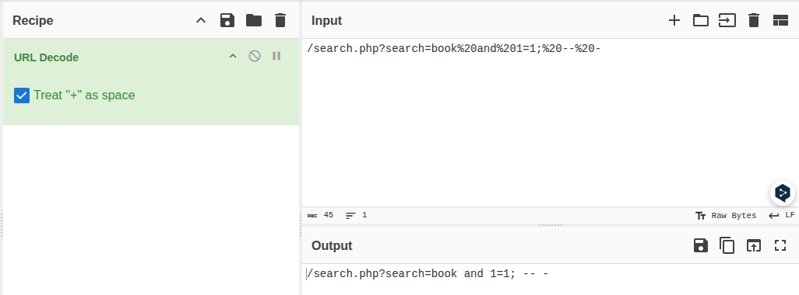

# Q5. Can you provide the complete request URI that was used to read the web server's available databases?

**Answer:** `/search.php?search=book' UNION ALL SELECT NULL,CONCAT(0x7178766271,JSON_ARRAYAGG(CONCAT_WS(0x7a76676a636b,schema_name)),0x7176706a71) FROM INFORMATION_SCHEMA.SCHEMATA-- -`

To investigate the SQL injection attempts targeting the web server, we first focus on filtering HTTP requests involving the `search.php` script. Filtering these requests provides insight into the specific payloads submitted by the attacker.

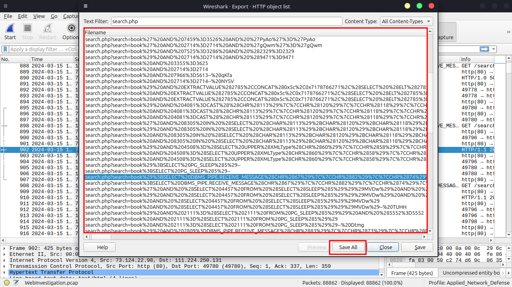

Decoding these encoded payloads is a crucial step in understanding the attack. Using Python, we decode the URL parameters to reveal their true content.

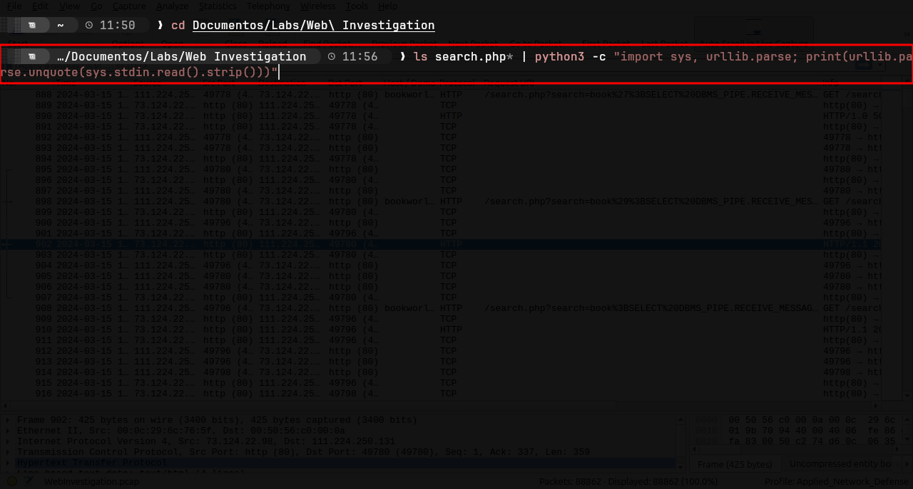

The decoding process exposes query strings that exploit the `INFORMATION_SCHEMA` database, which is a system database in SQL environments storing metadata about other databases, tables, and columns.

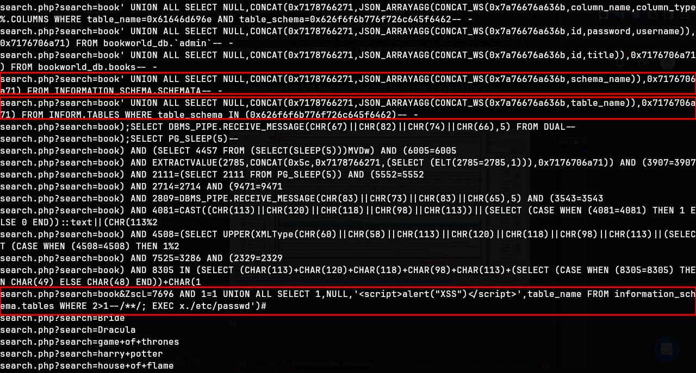

Encode: `/search%2Ephp?search=book'%20UNION%20ALL%20SELECT%20NULL,CONCAT(0x7178766271,JSON%5FARRAYAGG(CONCAT%5FWS(0x7a76676a636b,schema%5Fname)),0x7176706a71)%20FROM%20INFORMATION%5FSCHEMA%2ESCHEMATA%2D%2D%20%2D`

Decode: `/search.php?search=book' UNION ALL SELECT NULL,CONCAT(0x7178766271,JSON_ARRAYAGG(CONCAT_WS(0x7a76676a636b,schema_name)),0x7176706a71) FROM INFORMATION_SCHEMA.SCHEMATA-- -`

# Q6. Assessing the impact of the breach and data access is crucial, including the potential harm to the organization's reputation. What's the table name containing the website users data?   

**Answer:** `customers`

Since the attacker was running SQL injection attempts, I looked at the server's responses to those payloads rather than at the requests. In packet 1553, the response to a `UNION SELECT` payload listed multiple database table names (`[books,customers,method,action,form]`). Of those, `customers` is the one that logically stores the website's user data, meaning the breach exposed customer information and creates reputational risk for the organization.

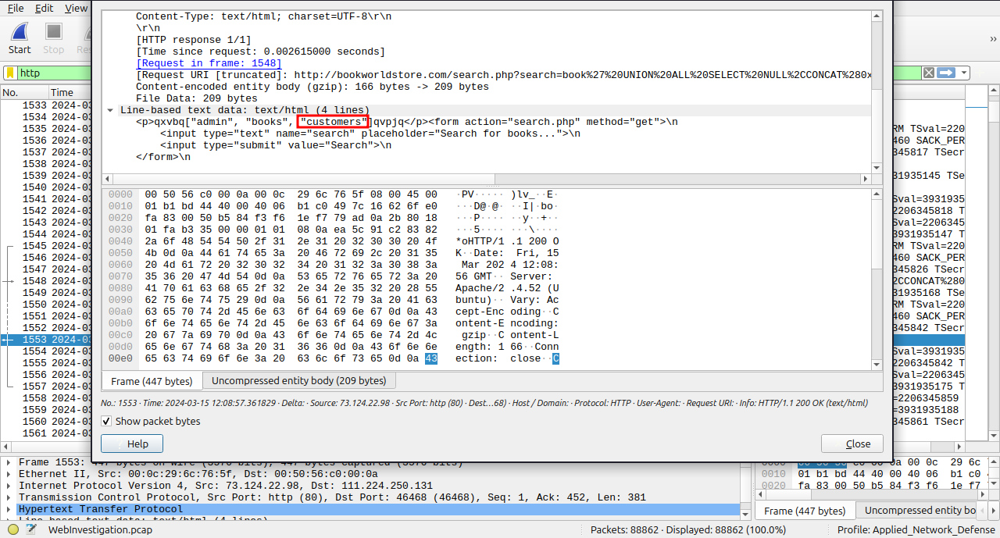

# Q7. The website directories hidden from the public could serve as an unauthorized access point or contain sensitive functionalities not intended for public access. Can you provide the name of the directory discovered by the attacker?

**Answer:** `/admin/`

With the filter **http.request.method == POST** we can see the logs with unauthorized acces points. And also, find the directory.

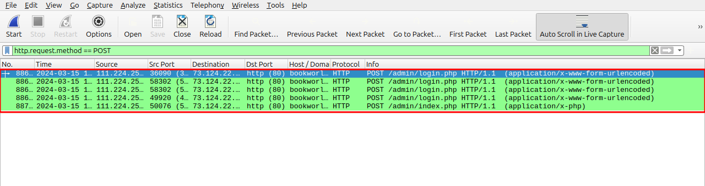

# Q8. Knowing which credentials were used allows us to determine the extent of account compromise. What are the credentials used by the attacker for logging in?

**Answer:** `admin:admin123!`

With the same filter **(http.request.method == POST)** we look for the logs with /admin/login.php.

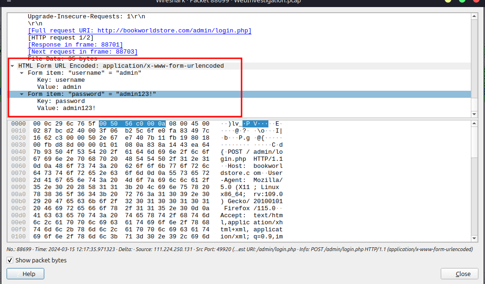

# Q9. We need to determine if the attacker gained further access or control of our web server. What's the name of the malicious script uploaded by the attacker?

**Answer:** `NVri2vhp.php`

I filtered the traffic with `http.request.method == POST` and focused on requests to `/admin/login.php`, where the `username=` and `password=` fields are submitted. The attempt that received a `302 Found` redirect to `/admin/index.php` was the successful one, confirming those credentials were valid and the admin account was compromised.

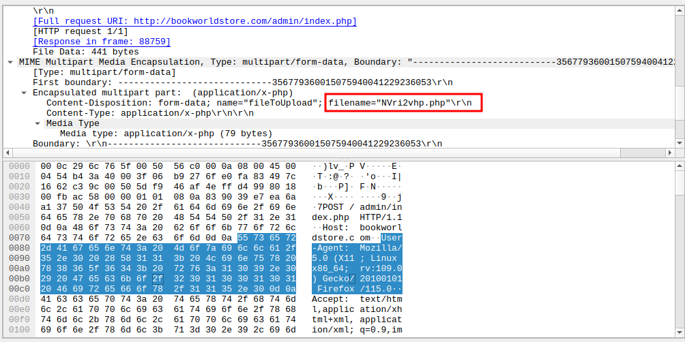
